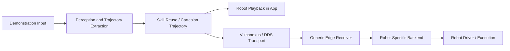
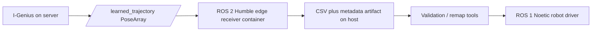

# I-Genius

I-Genius is an open-source visual imitation learning toolkit for manipulation workflows. It provides a local-first Streamlit interface for processing demonstrations, generating reusable Cartesian trajectories, visualizing robot playback, and transporting robot-ready paths across machines using Vulcanexus.

## Highlights

- Local-first workflow for video, BAG, SVO, and prepared ZIP inputs
- Trajectory extraction, adaptation, and skill reuse pipeline
- Robot playback and inverse-kinematics visualization inside the app
- Vulcanexus-based trajectory publishing from the UI
- Reusable edge receiver pattern for mixed ROS 1 / ROS 2 deployments
- FIWARE sandbox compose file for northbound experiments

## Architecture



For an Ubuntu 20.04 robot workstation with ROS 1 Noetic drivers and a ROS 2 Humble communication container, the recommended split is:



## Repository Scope

This public repository includes:

- the local-first application flow
- the proven Vulcanexus integration
- reusable edge receiver and status helpers
- FIWARE sandbox compose file
- documentation for the edge contract and deployment pattern

This public repository does not include:

- private platform credentials
- private package feeds
- private deployment pipelines
- internal cloud integrations

## Quick Start

### 1. Create a Python environment

```bash
python3.12 -m venv .venv
source .venv/bin/activate
pip install --upgrade pip uv
uv sync
```

### 2. Run the local-first app

```bash
source .venv/bin/activate
uv run streamlit run src/streamlit_template/new_ui/pages/Common/landing_page.py   --server.port 8504   --server.address 0.0.0.0
```

Open:

```text
http://localhost:8504
```

### 3. Docker run

```bash
docker compose up --build
```

The app will be available at:

```text
http://localhost:9002
```

## Typical Local Workflow

1. Open the app and choose `Local Workspace`
2. Upload a video, BAG, SVO, or prepared ZIP input
3. Run the pipeline
4. Inspect the generated trajectory and robot playback
5. Use `Push to Robot` from the robot step when you want to publish through Vulcanexus

## Vulcanexus Integration

The UI can publish the final trajectory using:

- topic: `/learned_trajectory`
- type: `geometry_msgs/msg/PoseArray`

Important scripts:

- `scripts/vulcanexus/docker_publish_traj.sh`
- `scripts/vulcanexus/traj_pose_array_pub.py`
- `scripts/vulcanexus/traj_pose_array_sub.py`
- `scripts/vulcanexus/traj_status_sub.py`
- `scripts/vulcanexus/edge_receive_posearray.py`
- `scripts/vulcanexus/run_edge_receiver.sh`
- `docs/edge_receiver_contract.md`

## Reusable Edge Pattern

The reusable edge boundary is intentionally simple:

1. receive the trajectory on ROS 2
2. persist a normalized artifact (`csv` + `metadata.json`)
3. hand off to a robot-specific backend

This allows the producer side to stay robot-agnostic while the edge side remains adaptable to different robot stacks.

## FIWARE Sandbox

A basic Orion-LD + Mongo sandbox is provided in:

- `docker-compose.fiware.yml`

Start it with:

```bash
docker compose -f docker-compose.fiware.yml up -d
```

## Project Structure

- `src/streamlit_template/` — application UI and pipeline logic
- `scripts/vulcanexus/` — Vulcanexus transport, edge receiver, and helper scripts
- `docs/edge_receiver_contract.md` — reusable edge contract
- `docker-compose.fiware.yml` — FIWARE sandbox services

## Notes for Open-Source Use

Before using this repository in production, review:

- robot-specific safety validation
- workspace and frame assumptions
- deployment-specific security and network configuration
- licensing of any third-party assets bundled with your deployment
