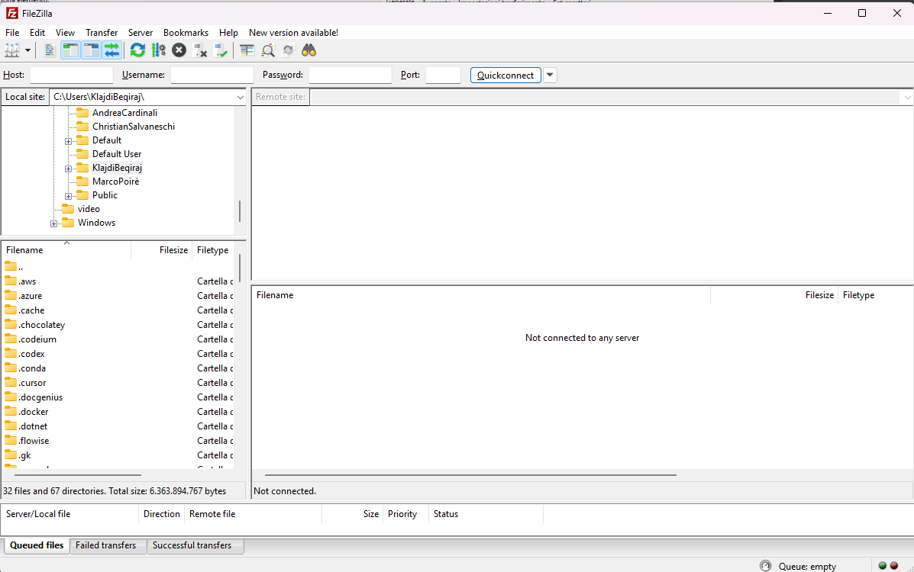
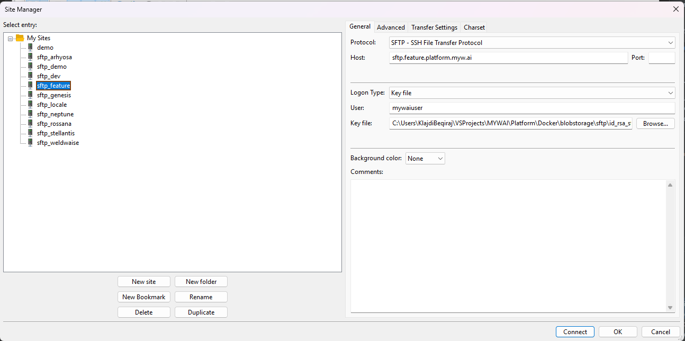
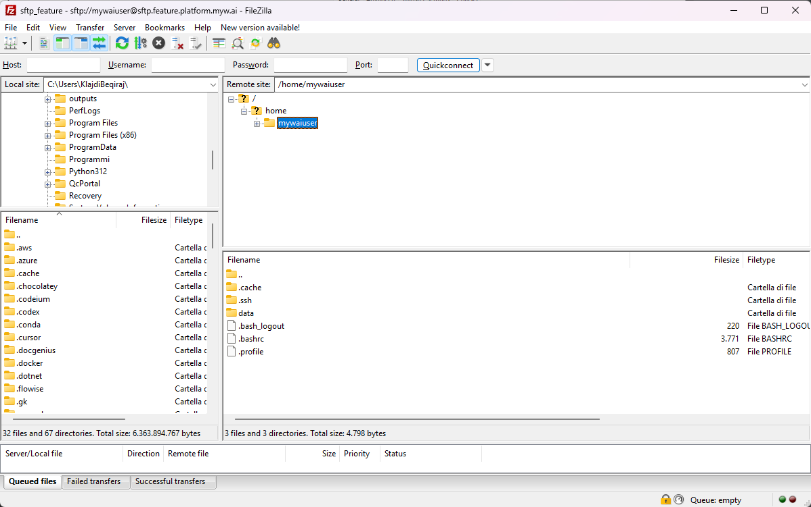
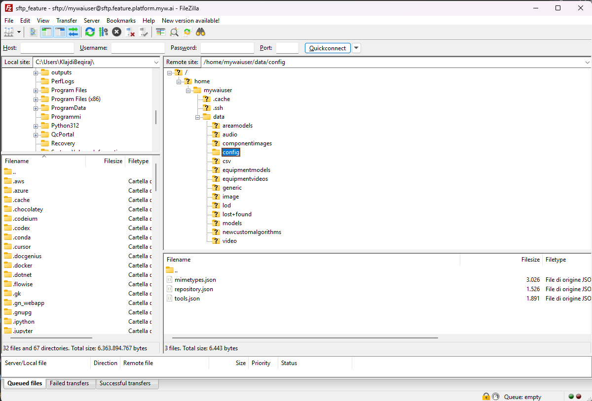

# Integration with MyWai 2.1

This guide explains how to integrate a toolkit once it has been deployed or when running locally. The integration process varies depending on your deployment scenario.

## Integration Scenarios

There are three main scenarios for integrating your toolkit with MyWai:

### 1. Deployed Toolkit
When your toolkit is deployed to a production environment, you will use the production URL provided by your deployment platform.

### 2. Local Toolkit with MyWai on Cloud
When running your toolkit locally but connecting to MyWai in the cloud, you need to use **ngrok** to expose the local container port. This allows the cloud-based MyWai platform to communicate with your locally running toolkit during the embryonic/testing phase.

### 3. Local Toolkit with Local MyWai
When both your toolkit and MyWai are running locally, you also need to use **ngrok** to expose the container port, similar to scenario 2, to enable proper communication between the local services.

---

## Step-by-Step Integration

### Step 1: Open FileZilla

Open FileZilla on your local machine. You should see the main FileZilla interface:



### Step 2: Access Site Manager

Click on the **Site Manager** icon in the toolbar (the icon with three stacked servers) located at the top left of the FileZilla window. Alternatively, you can access it from the menu: **File → Site Manager**.



### Step 3: Create a New Site

1. In the Site Manager window, click the **"New site"** button in the left pane.
2. A new entry will appear under "My Sites" - you can rename it to identify your MyWai environment (e.g., "sftp_feature", "sftp_dev", etc.).

### Step 4: Configure Site Settings

In the right pane, configure the following settings:

#### General Tab

1. **Protocol**: Select **"SFTP - SSH File Transfer Protocol"** from the dropdown menu.

2. **Host**: Enter the SFTP host address. Follow the naming convention shown in the example:
   - Format: `sftp.{environment}.platform.myw.ai`
   - Example: `sftp.feature.platform.myw.ai` (for feature environment)
   - Replace `{environment}` with your specific environment name (e.g., `dev`, `feature`, `demo`, etc.)

3. **Port**: Leave this field empty (default SFTP port will be used).

4. **Logon Type**: Select **"Key file"** from the dropdown menu.

5. **User**: Enter **`mywaiuser`** in the User field.

6. **Key file**: 
   - **Request the SSH key file from the MyWai team**
   - Save the key file locally on your machine (e.g., `C:\Users\YourUsername\path\to\id_rsa_s`)
   - Click the **"Browse..."** button next to the Key file field
   - Navigate to and select the key file you saved locally
   - The full path will appear in the Key file field

### Step 5: Save and Connect

1. Click **"OK"** to save the site configuration.
2. To connect immediately, you can click **"Connect"** instead of "OK", or close the Site Manager and connect later by selecting the site from the Site Manager and clicking "Connect".



Once connected, you should see the remote server directory structure in the right pane of FileZilla.

### Step 6: Navigate to Config Directory

1. In the **Remote site** pane (right side), navigate to the config directory:
   - Start from the root directory `/`
   - Expand `home` → `mywaiuser` → `data` → `config`
   - The full path should be: `/home/mywaiuser/data/config`



2. You should now see the `tools.json` file in the file list along with other configuration files like `mimetypes.json` and `repository.json`.

### Step 7: Download tools.json

1. In the **Remote site** pane, locate the `tools.json` file.
2. Right-click on `tools.json` and select **"Download"**, or simply drag and drop the file from the remote pane to your desired local directory in the left pane.
3. Save the file to a location on your local machine where you can easily edit it (e.g., `C:\Users\YourUsername\Downloads\tools.json`).

### Step 8: Understand the tools.json Structure

The `tools.json` file is a JSON array containing tool configuration objects. Each object represents a toolkit that can be integrated with the MyWai platform. Here's a detailed explanation of the structure:

#### Tool Object Structure

Each tool in the array is a JSON object with the following properties:

```json
{
  "uniqueId": "string",        // Unique identifier for the tool (must be unique across all tools)
  "name": "string",            // Display name of the tool
  "description": "string",     // Brief description of what the tool does
  "version": "string",         // Version number of the tool (e.g., "1.0")
  "webUrl": "string",          // URL where the tool is accessible (production URL or ngrok URL for local testing)
  "imageUrl": "string",        // URL to a preview/header image for the tool
  "iconUrl": "string",         // URL to an icon image (can be empty string)
  "dataTypes": ["string"]      // Array of data types the tool can process (e.g., ["image"], ["image", "video"])
}
```


#### Key Points About the Structure:

- **Array Format**: The file is a JSON array `[]` containing multiple tool objects.
- **uniqueId**: Must be unique for each tool. This is the identifier used by MyWai to distinguish between tools.
- **webUrl**: 
  - For **deployed tools**: Use the production URL (e.g., `https://your-tool.platform.myw.ai`)
  - For **local testing**: Use the ngrok URL (e.g., `https://455a-93-62-248-214.ngrok-free.app`)

### Step 9: Configure a New Tool

To add your toolkit to the MyWai platform, you need to add a new tool object to the `tools.json` file. Follow these steps:

1. **Open the downloaded `tools.json` file** in a text editor (e.g., VS Code, Notepad++, or any JSON editor).

2. **Add a new tool object** to the array. Here's a template:

```json
{
  "uniqueId": "your-tool-unique-id",
  "name": "Your Tool Name",
  "description": "A brief description of what your tool does",
  "version": "1.0",
  "webUrl": "YOUR_TOOL_URL",
  "imageUrl": "URL_TO_PREVIEW_IMAGE",
  "iconUrl": "",
  "dataTypes": ["image"]
}
```

3. **Fill in the required fields**:

   - **uniqueId**: Choose a unique identifier for your tool (e.g., `"my-streamlit-tool"`, `"custom-analysis-tool"`). This must be different from all other tools in the file.
   
   - **name**: The display name that will appear in the MyWai interface (e.g., `"My Streamlit Tool"`).
   
   - **description**: A brief description explaining what your tool does (e.g., `"Advanced data analysis and visualization tool"`).
   
   - **version**: The version number of your tool (e.g., `"1.0"`, `"2.1"`).
   
   - **webUrl**: 
     - **For Scenario 1 (Deployed)**: Use your production URL (e.g., `"https://your-tool.platform.myw.ai"`)
     - **For Scenario 2 (Local with MyWai on Cloud)**: Use your ngrok URL (e.g., `"https://abc123.ngrok-free.app"`)
     - **For Scenario 3 (Local with Local MyWai)**: Use your ngrok URL (e.g., `"https://xyz789.ngrok-free.app"`)
   
   - **imageUrl**: A URL to a preview image that will be displayed in the MyWai interface. This should be a publicly accessible image URL (e.g., `"https://example.com/preview.jpg"`).
   
   - **iconUrl**: Leave as an empty string `""` unless you have a specific icon URL.

### Step 10: Upload the Modified tools.json

After you've added your tool configuration to the `tools.json` file:

1. **Save the modified file** on your local machine.
2. **In FileZilla**, navigate back to `/home/mywaiuser/data/config` in the remote site pane.
3. **Upload the file**:
   - Drag and drop the modified `tools.json` from your local pane to the remote `/home/mywaiuser/data/config` directory, OR
   - Right-click on the local `tools.json` file and select **"Upload"**
4. **Confirm the overwrite** when prompted (since the file already exists on the server).

Your toolkit is now registered in the MyWai platform and should appear in the available tools list.

