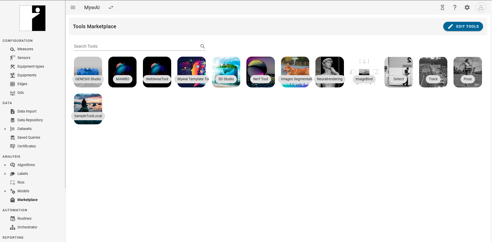
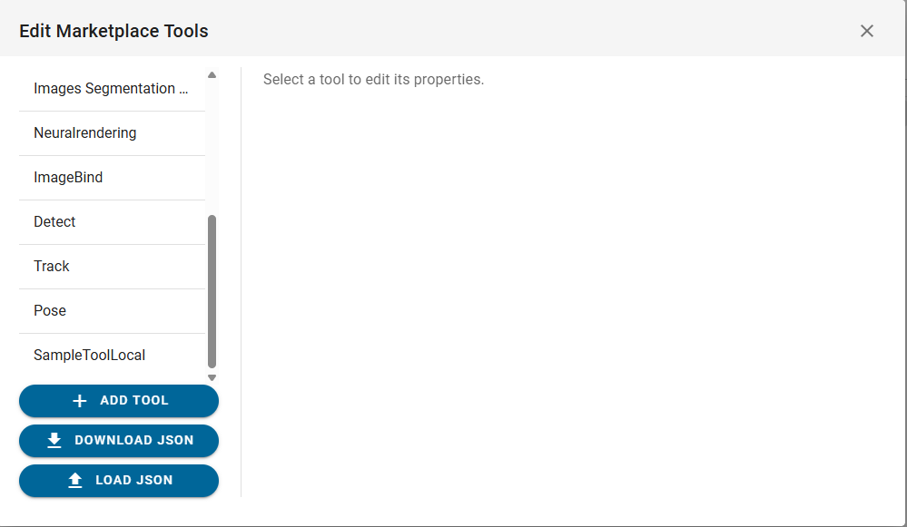
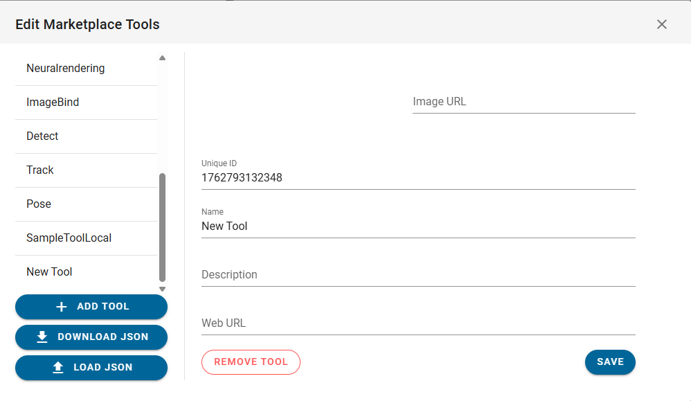

# Integration with MyWai 3

This guide explains how to integrate a toolkit once it has been deployed or when running locally. The integration process varies depending on your deployment scenario.

## Integration Scenarios

There are three main scenarios for integrating your toolkit with MyWai:

### 1. Deployed Toolkit
When your toolkit is deployed to a production environment, you will use the production URL provided by your deployment platform.

### 2. Local Toolkit with MyWai on Cloud
When running your toolkit locally but connecting to MyWai in the cloud, you need to use **ngrok** to expose the local container port. This allows the cloud-based MyWai platform to communicate with your locally running toolkit during the embryonic/testing phase.

### 3. Local Toolkit with Local MyWai
When both your toolkit and MyWai are running locally, you also need to use **ngrok** to expose the container port, similar to scenario 2, to enable proper communication between the local services.

---

## Step-by-Step Integration

### Step 1: Open the Marketplace Page

1. Log in to your MyWai 3 platform.
2. Navigate to the **Tools Marketplace** page. You can find it in the left sidebar under the **ANALYSIS** section → **Marketplace**.

The marketplace page displays all available tools in a grid layout. You should see various tool cards representing different toolkits integrated with the platform.

### Step 2: Access Edit Tools

1. On the marketplace page, locate the **"EDIT TOOLS"** button in the top right corner of the header bar (it has a pencil icon).
2. Click the **"EDIT TOOLS"** button to open the tool management interface.

This will open a modal window that allows you to manage and configure tools in the marketplace.

### Step 3: Add a New Tool

1. In the **Edit Marketplace Tools** modal, you'll see a list of existing tools on the left side.
2. Scroll down to the bottom of the tool list and click the **"+ ADD TOOL"** button.

3. A new tool entry will be created and automatically selected. You'll see it appear in the tool list on the left (it will be named "New Tool" initially) and its configuration fields will appear on the right side of the modal.

### Step 4: Configure Tool Parameters

With the new tool selected, you'll see the configuration fields in the right pane. Fill in the following parameters:

#### Tool Configuration Fields

1. **Image URL**: 
   - Enter a URL to a preview/header image that will be displayed in the marketplace
   - This should be a publicly accessible image URL (e.g., `https://example.com/preview.jpg`)
   - This image will appear on the tool card in the marketplace
   - **⚠️ CRITICAL**: If you do not provide an Image URL, the tool **will not be visible** in the marketplace. This field is mandatory for the tool to appear in the Tools Marketplace grid.

2. **Unique ID**: 
   - A unique identifier is automatically generated (e.g., `1762793132348`)
   - You can modify this to a more meaningful identifier (e.g., `"my-streamlit-tool"`, `"custom-analysis-tool"`)
   - **Important**: This ID must be unique across all tools in the marketplace
   - For local testing vs. production, use different IDs (e.g., `"my-tool"` for production and `"my-tool-dev"` for development)

3. **Name**: 
   - Enter the display name for your tool (e.g., `"My Streamlit Tool"`)
   - This name will appear on the tool card in the marketplace
   - Replace the default "New Tool" text with your tool's name

4. **Description**: 
   - Enter a brief description explaining what your tool does
   - Example: `"Custom Streamlit application for data analysis and visualization"`
   - This description helps users understand the tool's purpose

5. **Web URL**: 
   - Enter the URL where your toolkit is accessible
   - **For Scenario 1 (Deployed)**: Use your production URL (e.g., `https://your-tool.platform.myw.ai`)
   - **For Scenario 2 (Local with MyWai on Cloud)**: Use your ngrok URL (e.g., `https://abc123.ngrok-free.app`)
   - **For Scenario 3 (Local with Local MyWai)**: Use your ngrok URL (e.g., `https://xyz789.ngrok-free.app`)
   - **Important**: If using ngrok, remember that ngrok URLs change each time you restart ngrok (unless you have a paid account with a static domain). You'll need to update this URL each time.

#### Example Configuration

Here's an example of how to fill in the fields:

- **Image URL**: `https://images.pexels.com/photos/590570/pexels-photo-590570.jpeg`
- **Unique ID**: `streamlit-template-tool`
- **Name**: `Streamlit Template Tool`
- **Description**: `Custom Streamlit application for data analysis and visualization`
- **Web URL**: `https://your-ngrok-url.ngrok-free.app` (or your production URL)

### Step 5: Save the Tool

1. After filling in all the required fields, click the **"SAVE"** button located at the bottom right of the modal.
2. Your tool will be saved and added to the marketplace.

### Step 6: Verify Tool Registration

1. Close the **Edit Marketplace Tools** modal by clicking the **"X"** button in the top right corner.
2. You should now see your new tool appear in the Tools Marketplace grid.
3. The tool card will display the image you specified, and clicking on it will open your toolkit at the configured Web URL.

### Additional Features

The Edit Marketplace Tools interface also provides:

- **DOWNLOAD JSON**: Export the current tool configurations as a JSON file
- **↑ LOAD JSON**: Import tool configurations from a JSON file (useful for bulk updates or backups)
- **REMOVE TOOL**: Delete a tool from the marketplace (red button below the configuration fields)

Your toolkit is now registered in the MyWai 3 platform and should appear in the available tools list in the marketplace.

